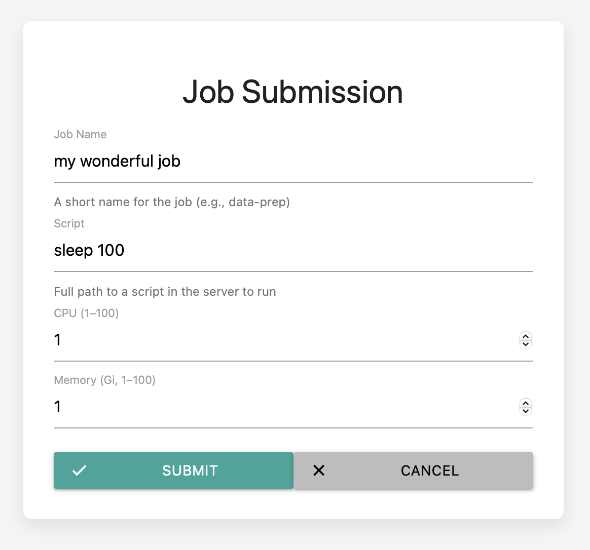

# Changelog

All notable changes to this project will be documented in this file.

## v0.2.13

Small release to add GUI capabilites with `darkroom job submit --gui`

## v0.2.8

- Improved job support:
  - add extra information to job status and list useful for debugging
  - job list accepts flags to filter jobs by status
  - job shell behaves like a normal shell now
- Support backend changes:
  - job status and job list now use database information
  - job submit now appends a unique job id to the job name
  - job status returns job logs if these exist

## v0.2.7

- Use GitHub secrets to add secure encryption and server keys
- Add validation of jobs resource requests
- Improved job shell command
- Improve error handling and reporting

## v0.2.5

- First attempt at colouring error messages and other terminal outputs
- Check that a file exists in the remote storage before deleting
- Initial support for a key to be sent in all request headers

### New commands

- `darkroom config set` - add a new command to set variables directly in the configuration file.
- `darkroom storage mb` - add a new command to create a bucket

## v0.2.4

Initial release of Darkroom CLI for storage management and authentication.

### Authentication
- `darkroom login` – authenticate with the remote API

### Storage Management
- `darkroom storage ls <path>` – list buckets or folder contents
- `darkroom storage cp <local> <remote>` – copy files to/from remote storage
- `darkroom storage rm <path>` – delete remote file or directory (`--recursive` supported)
- `darkroom storage stat <path>` – show metadata for remote object

### Utilities
- `darkroom version` – show Darkroom version, Git commit, and build date
- Configuration stored in `~/.darkroom/config.yaml` (encrypted)

